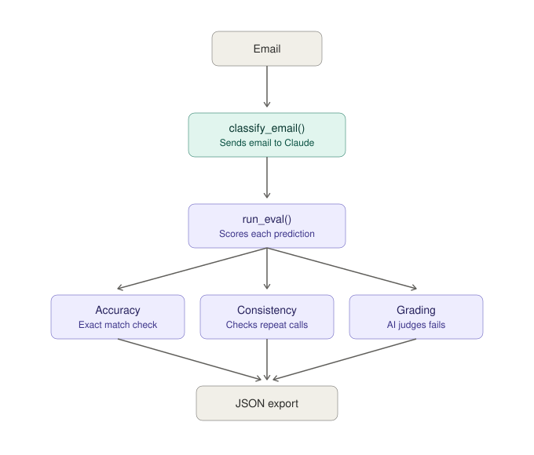

# Pure Python Evals — Gmail Classifier Eval Framework


## 📌 Overview

This project is a Gmail label classifier Eval Framework built using the Claude API and python

It  tests LLM output/categorization against accuracy, consistency, and model-based grading. 

## ✅ What it checks
- Accuracy — "is Claude's answer the RIGHT answer?"
- Consistency — "does Claude agree with itself across repeated calls?"
- Code-based grading — "is the predicted label even a valid category, checked with plain Python logic?"
- Model-based grading — "asks Claude to review a classification for reasonableness (Mode B grading)"


## 🖼️ Workflow Screenshot




## 🔄 Workflow

1. `classify_email.py` sends one email's text to Claude and returns a predicted label
2. `run_eval.py` runs each test email through the classifier and checks it four ways:
   - Accuracy — does the prediction match the expected label?
   - Consistency — does Claude give the same answer across repeated calls?
   - Code-based grading — is the predicted label one of the 6 valid categories (checked with plain Python, no API call)?
   - Model-based grading — Claude reviews its own classification for reasonableness (only on failures)
3. Results print to the terminal and export to `eval_results.json` and `consistency_results.json`


## 📁 Project Structure

```
01-pure-python-evals

├── classify_email.py
├── test_data.py
├── run_eval.py
├── eval_results.json
├── consistency_results.json
├── workflow_screenshot.svg
├── .env
├── README.md
└── requirements.txt

```

## 🛠️ Tech stack
- Python
- Anthropic Claude API(via the `anthropic` Python SDK)
- python-dotenv


## ▶️ How to run it
1. Clone the repo
2. `pip install -r requirements.txt`
3. Add your API key to a `.env` file: `ANTHROPIC_API_KEY=your-key-here`
4. `python run_eval.py`


## 📊 Sample output

```
Latency:0.85 seconds
[PASS] expected: Bills & Utilities  got: Bills & Utilities
Latency:0.67 seconds
[PASS] expected: Job Alerts  got: Job Alerts
Latency:0.60 seconds
[PASS] expected: Shipping & Orders  got: Shipping & Orders
Latency:0.73 seconds
[PASS] expected: Learning & Courses  got: Learning & Courses
Latency:0.80 seconds
[PASS] expected: High Priority  got: High Priority
Latency:0.58 seconds
[PASS] expected: Alerts & Newsletters  got: Alerts & Newsletters
Latency:1.28 seconds
[FAIL] expected: High Priority  got: Job Alerts
Valid
Latency:0.71 seconds
[PASS] expected: Bills & Utilities  got: Bills & Utilities
Latency:0.54 seconds
[PASS] expected: Learning & Courses  got: Learning & Courses
Latency:0.69 seconds
[PASS] expected: Shipping & Orders  got: Shipping & Orders
Accuracy: 90.0%

```

## 👩‍💻 Author
Swati J 
